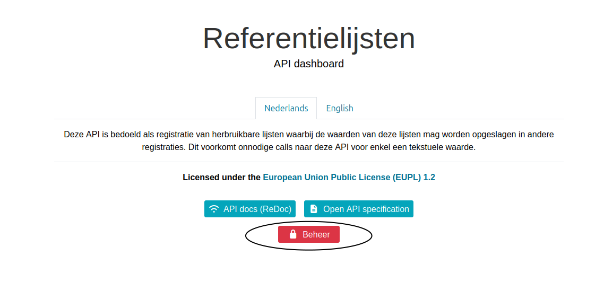
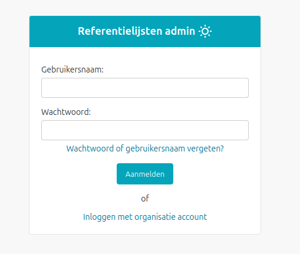
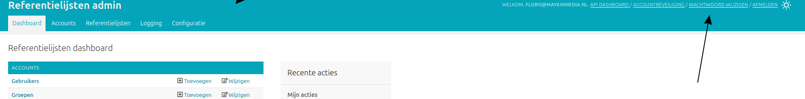

.. _manual_general:

====================
Algemene onderwerpen
====================

De algemene onderwerpen beschrijven acties voor medewerkers met toegang tot de
beheerinterface van Referentielijsten (hierna *de admin* genoemd).

In deze handleiding nemen we aan dat Referentielijsten geïnstalleerd is en beschikbaar
op het adres https://referentielijsten.gemeente.nl.

.. _manual_login:

Inloggen
========

Om in te loggen in de admin kan je navigeren naar de startpagina
https://referentielijsten.gemeente.nl. Klik vervolgens op **Beheer**:

Vul je gebruikersnaam en wachtwoord in op het loginscherm:

Na het aanmelden zie je het dashboard. Afhankelijk van je gebruikersrechten
zie je meer of minder items op het dashboard.

Wachtwoord wijzigen
===================

Eenmaal :ref:`ingelogd <manual_login>`, kan je je wachtwoord wijzigen via de
link rechtsboven:

Vul vervolgens je **huidige** wachtwoord in, je **nieuwe** wachtwoord en
je nieuwe wachtwoord ter **bevestiging**.

Klik rechtsonderin op **Mijn wachtwoord wijzigen** om je nieuwe wachtwoord in
te stellen.

.. note::
    Merk op dat er bepaalde regels gelden om een voldoende sterk
    wachtwoord in te stellen. We raden aan om een *password manager* te
    gebruiken om een voldoende sterk wachtwoord in te stellen.

Dashboard
=========

De gegevens die in de admin beheerd kunnen worden, zijn gegroepeerd op het
dashboard. Deze groepen worden hier verder beschreven. Merk
op dat het mogelijk is dat je bepaalde groepen niet ziet omdat je onvoldoende
rechten hebt.

Accounts
--------

**Gebruikers** zijn de personen die in kunnen loggen in de admin. Aan
gebruikers worden rechten toegekend die bepalen wat ze precies kunnen inzien
en/of beheren. Gebruikers kunnen gedeactiveerd worden, waardoor ze niet langer
in kunnen loggen. Ga naar :ref:`manual_users_add` om te leren hoe je een
gebruiker toevoegt en configureert.

**Groepen** definiëren een set van permissies die een gebruiker toelaten om
gegevens in te zien en/of beheren. Een gebruiker kan tot één of meerdere
groepen behoren.

.. _manual_authorizations:

Gegevens
--------

De groep *referentielijsten* laat je toe om lijsten aan te maken, in te zien te wijzigen en te verwijderen.
Zie :ref:`referentielijsten <manual_referentielijsten>`

Logging
-------

Er worden vaak informatieve logberichten weggeschreven die kunnen wijzen op een
probleem in de Referentielijsten applicatie. Deze worden via de logs inzichtelijk
gemaakt.

Via **Access attempts** en **Access logs** kan je de inlogpogingen en sessies
in de admin van gebruikers bekijken. Deze worden gelogd om *brute-forcing*
tegen te kunnen gaan en inzicht te verschaffen in wie op welk moment toegang
had tot het systeem.

Configuratie
------------

Het configuratiegedeelte dient om de Referentielijsten-installatie te configureren.
Typisch wordt dit initieel bij installatie geconfigureerd.

Lijst- en detailweergaves
=========================

De structuur van de admin volgt voor het grootste deel hetzelfde patroon:

1. Vertrek vanaf het dashboard
2. Klik een onderwerp aan binnen een groep, bijvoorbeeld *Tabellen*
3. Vervolgens zie je een lijst van gegevens
4. Na het doorklikken op één item op de lijst zie je een detailweergave
