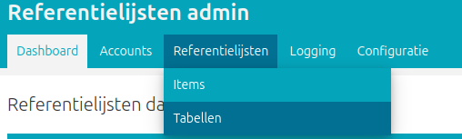
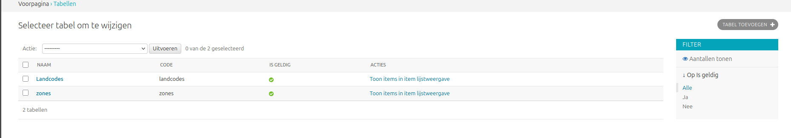
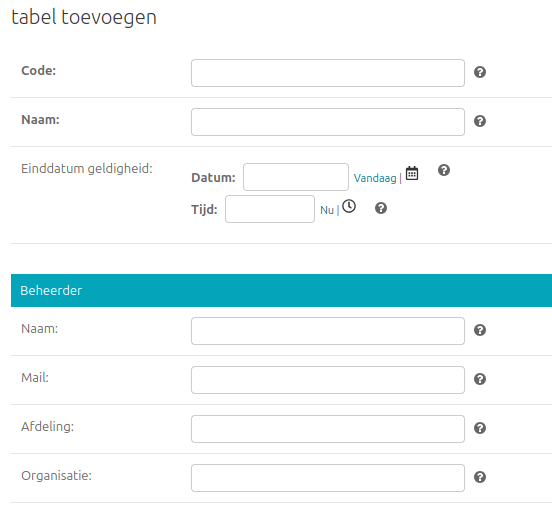
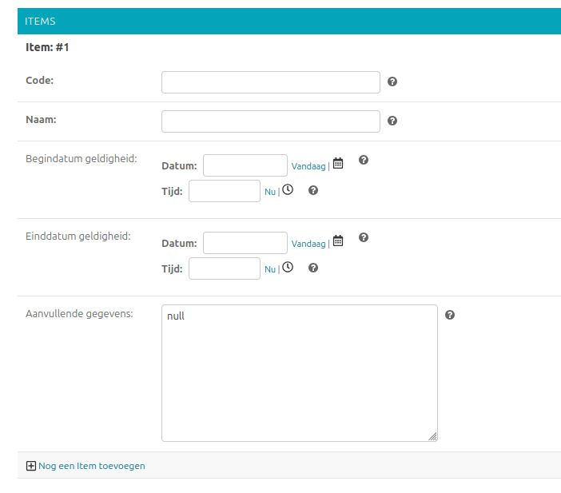
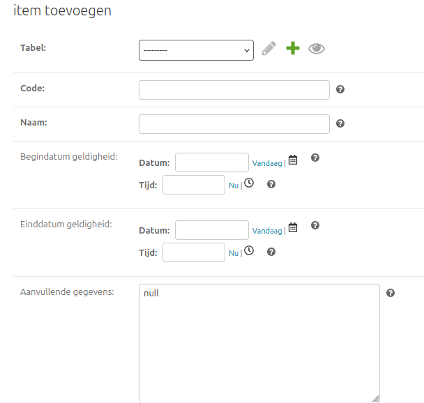
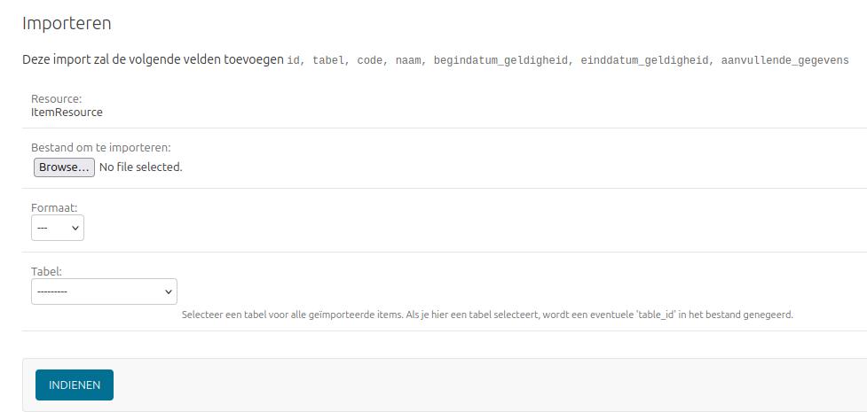
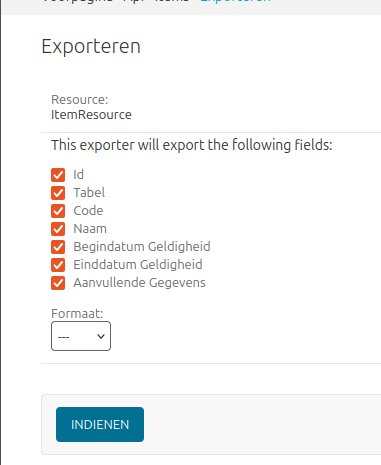

.. _manual_referentielijsten:

Referentielijst
===============

Via de Admin -> Referentielijsten kunnen tabellen & items worden aangemaakt en aangepast.

Tabellen
--------
Op de Tabellen pagina is een lijst met alle tabellen te zien.

Door op een tabel te klikken kan een tabel worden aangepast, of via ``tabel toevoegen`` kan een nieuwe tabel worden toegevoegd.
De verplichte velden van een tabel zijn een unieke code en een naam. Daarnaast kan er een einddatum worden ingesteld en een beheerder worden toegevoegd.

Op de tabel detail pagina kunnen ook items worden aangemaakt. Voor een item zijn een unieke code (per tabel) en naam verplicht. Daarnaast kunnen er een begin- & einddatum en aanvullende gegevens worden ingevuld.

Via ``Nog een item toevoegen`` kan er een extra item aan de tabel worden toegevoegd.

Items
-----
Via Admin -> referentielijsten -> items kunnen ook  in een keer alle items worden bekeken. Via de detail pagina kan een enkel item worden gewijzigd of aangemaakt.
Bij het aanmaken van een item via de item detail pagina moet ook een tabel waarbij het item onderdeel van is worden opgegeven.

Export
~~~~~~

Via Admin -> Referentielijsten -> Items -> Exporteren kunnen alle items worden geexporteerd in de volgende formats:

    * csv
    * xlsx
    * tsv
    * json
    * yaml

Ook kan worden geselecteerd welke item velden in de export moeten worden meegenomen

Import
~~~~~~
Via Admin -> Referentielijsten -> Items -> Importeren kan een bestand van een van de volgende formats worden ingeladen:

    * csv
    * xlsx
    * tsv
    * json
    * yaml

Tijdens de import kan een tabel worden opgegeven waardoor alle items in het bestand zullen worden gelinkt aan de opgegeven tabel.
Als dit veld wordt leeg gelaten zal de tabel_id kolom uit het bestand worden gebruikt. Via de Id kunnen bestaande items ook worden geupdate via een import.

