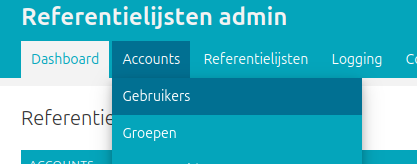
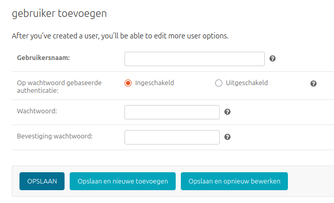
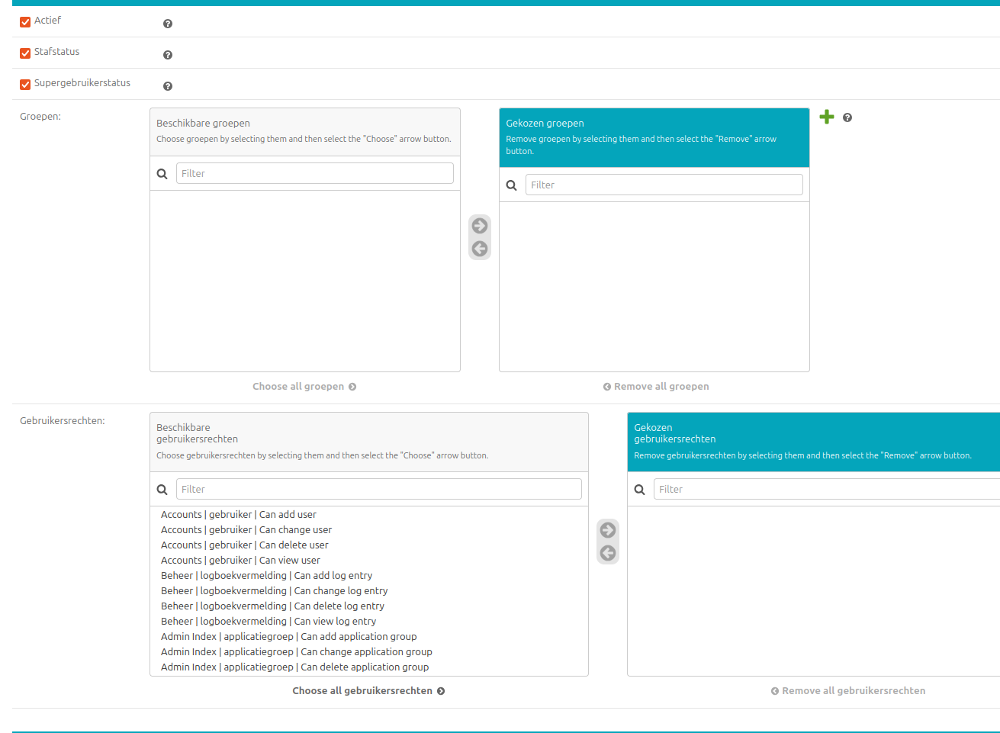

.. _manual_users:

=================
Gebruikerstoegang
=================

.. _manual_users_add:

Een gebruiker aanmaken
===================================================

Vertrek vanaf de startpagina en vind de groep **Accounts**. Klik vervolgens op
**Toevoegen** naast de titel **Gebruikers**:

Vul vervolgens een **gebruikersnaam** in en een **wachtwoord**. Vergeet niet om het
wachtwoord te **bevestigen**. Merk op dat er wachtwoordsterkte-regels gelden!

.. note:: Gebruikersnamen zijn hoofdlettergevoelig!

Klik vervolgens op **Opslaan en opnieuw bewerken**:

In het volgende scherm kan je vervolgens de rechten voor deze gebruiker instellen.

1. Het vinkje *Stafstatus* bepaalt of de gebruiker in kan loggen op de admin-omgeving.
2. Het vinkje *Supergebruikerstatus* geeft aan of de gebruiker altijd alle permissies
   heeft. We raden sterk aan om hier conservatief mee om te gaan.
3. Selecteer de gewenste *Gebruikersrechten* om autoraties toe te passen.
4. Klik op het pijltje naar rechts om de geselecteerde *Gebruikersrechten* toe te
   passen op de betreffende gebruiker.

Klik linkssonder op **Opslaan** om de wijzigingen door te voeren.
